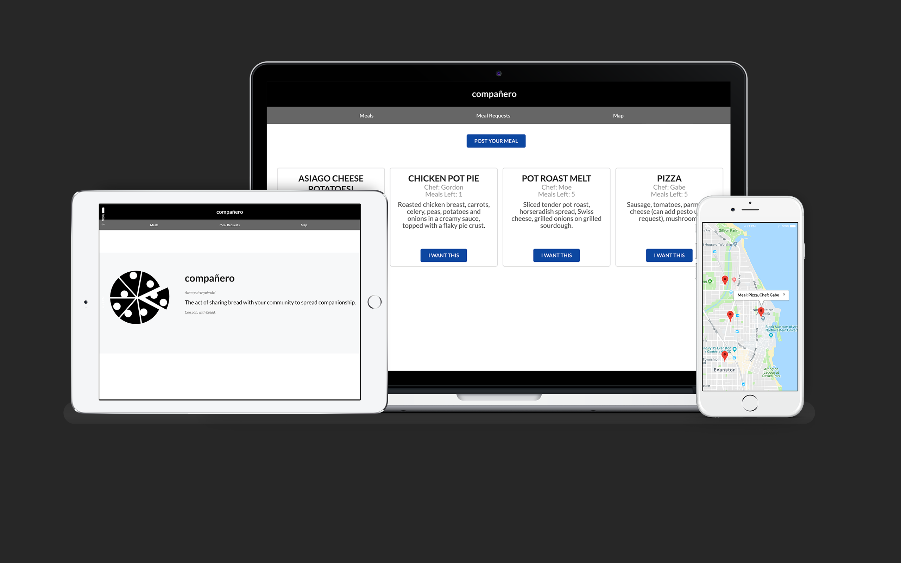

# Compañero - A Food Sharing Mobile-Compatible Web Application

*An application to reduce food waste, optimize food cost, and create community using the power of sharing meals!*

Built using the MERN stack, a software stack of free and open-source JS software for web development consisting of MongoDB, Express.js, React.js, Node.js.



Technologies Used:
---------
1. **yarn** (package manager, can also use npm)
2. **create-react-app** (npm package: creating boilerplate React app)
3. **express** (server framework)
4. **body-parser** (parses body from network requests)
5. **nodemon** (monitors changes in server and restarts when sees change)
6. **morgan** (allows logging to debug network requests)
7. **mongoose** (allows smoother interaction with mongodb)
8. **concurrently** (allows frontend web app and backend server to run simultaneously)
9. **babel-cli, babel-preset-es2015, babel-preset-stage-0** (allows usage of new JS syntax)
10. **react-markdown** (converts markdown into text)
11. **whatwg-fetch** (polyfill for the window.fetch object that fetches data from the browser)
12. **prop-type** (validates type of component)
13. **es-lint** (debugging)
14. **MLab** (database provider for MongoDB)
15. **Postman** (to validate API requests)
Running the App:
---------

To run the app, navigate to your terminal and type: 
```
$ cd purple-project2/
$ yarn
$ cd backend
$ yarn
$ cd..
$ cd client
$ yarn
$ cd ..

$ yarn start:dev
```
This will start both the React web app and backend server simultaneously and will automatically open the webapp on your browser.

For the curious folk, if you want to only start the backend server: `$ yarn start:server`, and if you only want to start the React app: `$ yarn start:client`.
